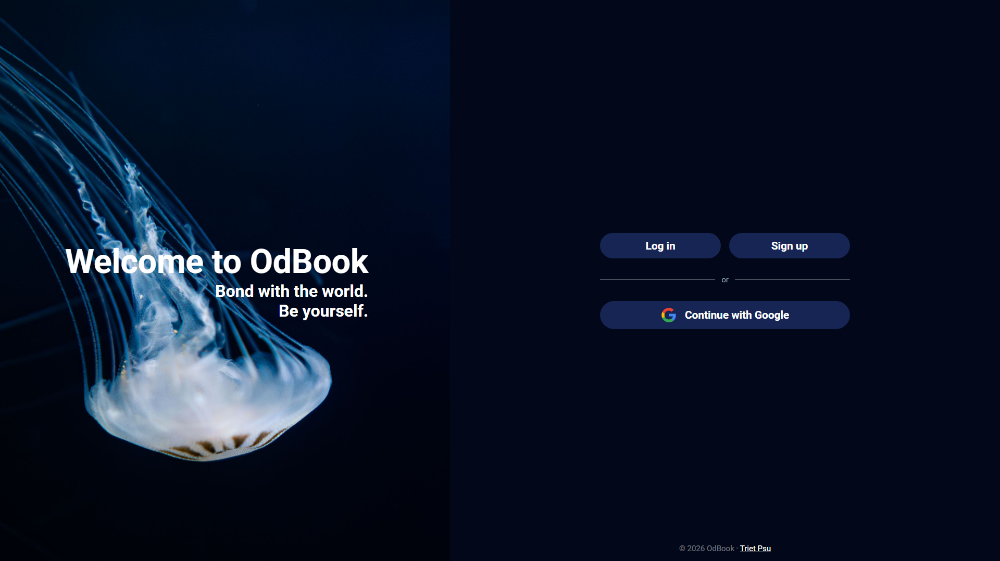
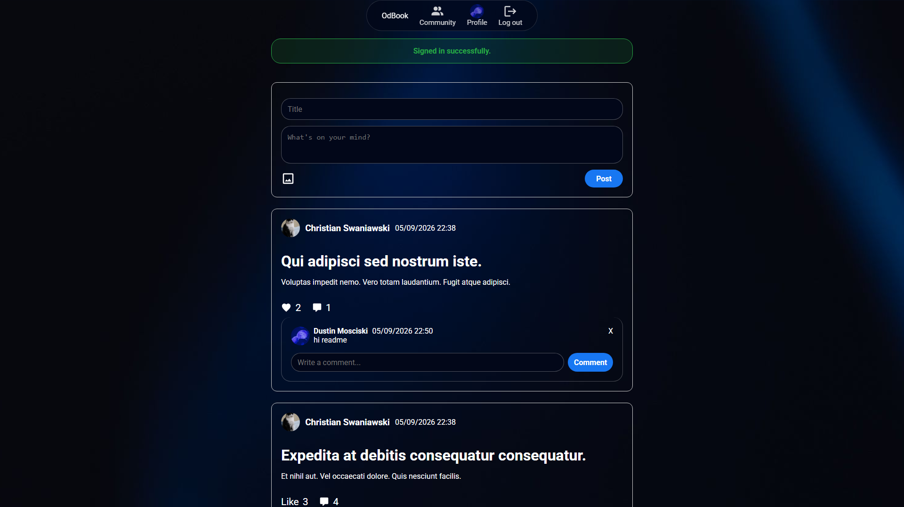
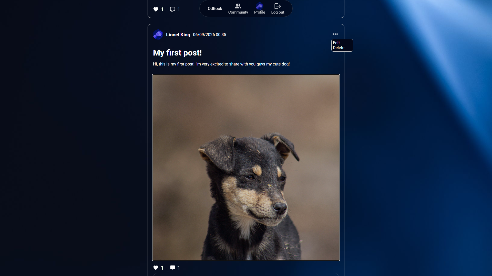
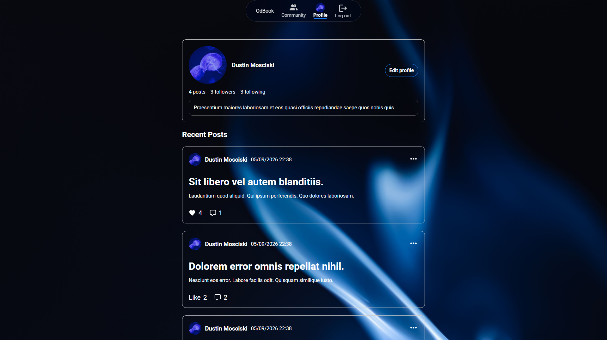
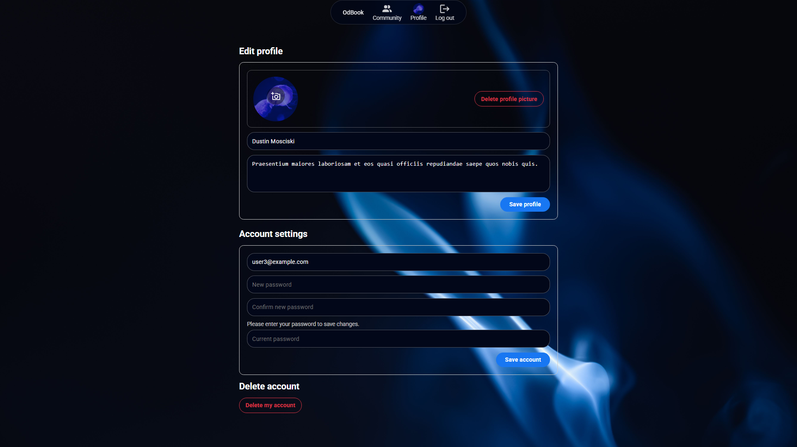

# OdinBook

OdinBook is a social networking web application built with **Ruby on Rails** as part of [The Odin Project](https://www.theodinproject.com/lessons/ruby-on-rails-odin-book) curriculum.

It includes core social features such as user authentication, posts, likes, comments, follow requests, profile management, and image uploads. The project uses modern Rails tools including **Turbo**, **Stimulus**, **Devise**, **OmniAuth**, and **Active Storage**.

## Live Demo

[View live app](https://odbook.onrender.com/)

## Preview

### Landing Page



### Home Page



### Posts Feed



### User Profile



### Edit Profile



## Features

- Sign up, log in, and log out with **Devise**
- Sign in with **Google OAuth2**
- Create, edit, and delete posts
- Upload multiple images per post
- Like and comment on posts
- Send, accept, and remove follow requests
- View user profiles and recent posts
- Edit profile name, bio, and avatar
- Dynamic UI updates with **Turbo Streams**
- File upload handling with **Active Storage**

## Usage

```bash
git clone https://github.com/trietpsu29/odbook.git
cd odbook
bundle install
bin/rails db:create db:migrate db:seed
bin/rails server
```

Then open:

```bash
http://localhost:3000
```

## Tech Stack

- Ruby on Rails
- Devise
- OmniAuth Google
- Turbo / Stimulus
- Active Storage
- Importmap
- HTML / CSS / JavaScript

## Project Structure

```text
app/
├── controllers/
├── models/
├── views/
└── javascript/

config/
├── routes.rb
├── application.rb
└── importmap.rb
```

## Deployment

Deployed using:

- **Render** for web hosting
- **Neon PostgreSQL** for production database
- **Cloudinary** for image storage with Active Storage

Production secrets are managed securely through Rails encrypted credentials.

Required environment variables:

- `DATABASE_URL`
- `RAILS_MASTER_KEY`

## Future Improvements

- Improve mobile responsiveness
- Add more automated tests
- Add more features to make the application closer to a real-world social media platform
- Improve performance and scalability for larger user bases

## Image Credits

External images and icons used in this project:

- **Pexels** — https://www.pexels.com/
- **Pictogrammers (Material Design Icons)** — https://pictogrammers.com/
- **Google Brand Resources** — https://about.google/brand-resource-center/

All external assets are used according to their respective licenses and terms of use.

## Acknowledgements

- [The Odin Project](https://www.theodinproject.com/)
- Rails, Devise, Turbo, Stimulus, and Active Storage documentation
